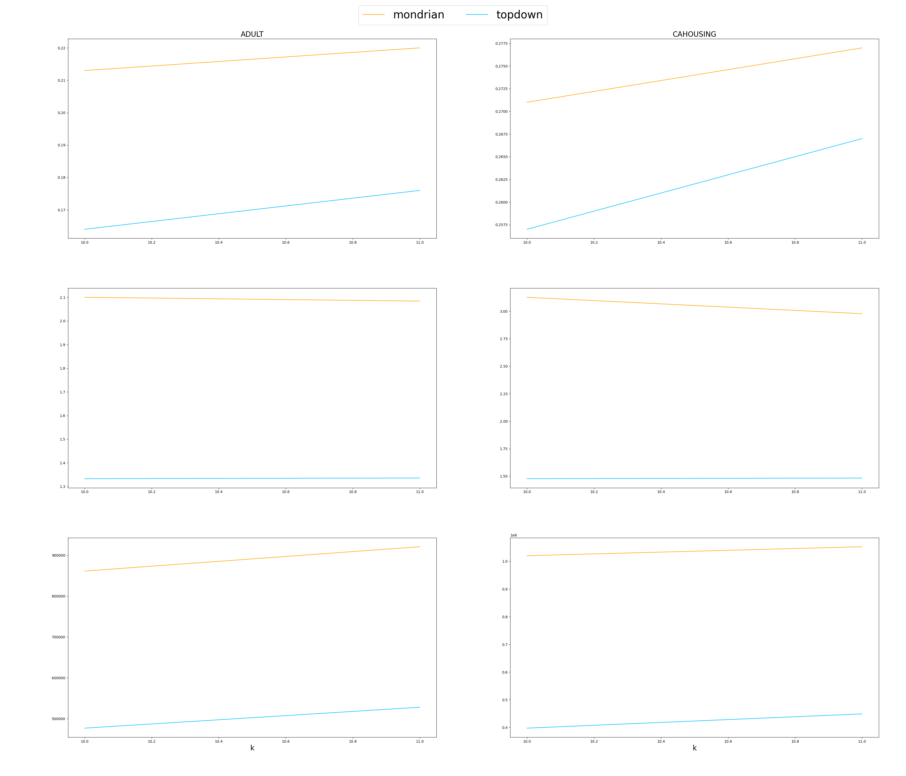
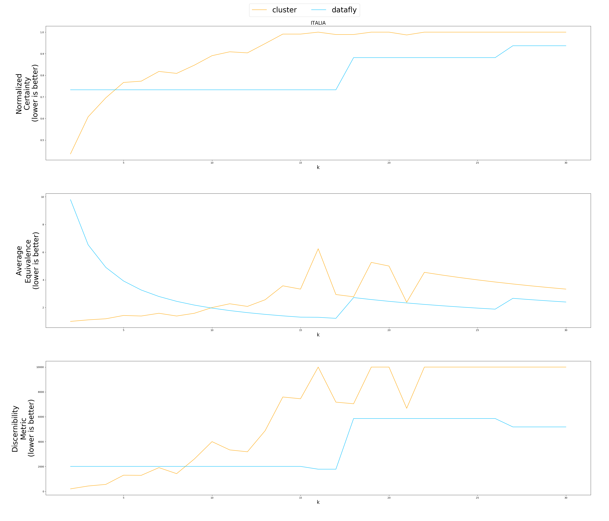
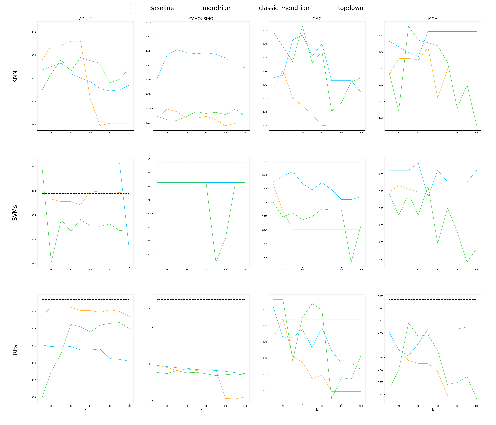
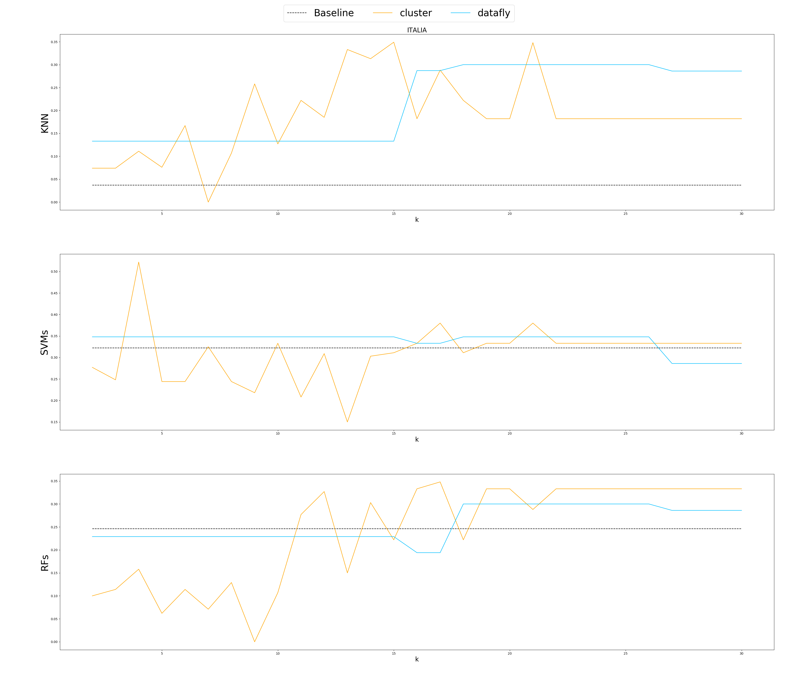

# Data anonymization using k-Anonymity
## Research
This study explores various k-anonymization methods, including Datafly, Incognito, Topdown Greedy, Classic Mondrian, and Basic Mondrian. It also employs three anonymization metrics: Equivalent Class size metric (CAVG), Discernibility Metric (DM), and Normalized Certainty Penalty (NCP). Additionally, three classification models, namely Random Forests, Support Vector Machines, and K-Nearest Neighbors, are implemented following the existing code. I added new dataset matching with NZTA data.
NZTA data is under folder `data/nzta`. The NZTA dataset used in this project contains the following fields:
### NZTA Dataset

| Name        | CarMake     | CarModel | Year | NumberPlate | Gender | Age | Date       | PrimaryContributor | CrashSeverity | Zipcode |
|-------------|-------------|----------|------|-------------|--------|-----|------------|--------------------|---------------|---------|
| John Smith  | Toyota      | Corolla  | 2017 | ABC-1234    | Male   | 34  | 2021-03-12 | Yes                | non-fatal     | 65001   |
| John Smith  | Toyota      | Corolla  | 2017 | ABC-1234    | Male   | 34  | 2022-03-31 | No                 | non-fatal     | 94005   |
| John Smith  | Toyota      | Corolla  | 2017 | ABC-1234    | Male   | 34  | 2022-01-01 | No                 | extremely     | 42955   |
| John Smith  | Toyota      | Corolla  | 2017 | ABC-1234    | Male   | 34  | 2022-01-14 | Yes                | extremely     | 36306   |
| John Smith  | Toyota      | Corolla  | 2017 | ABC-1234    | Male   | 34  | 2021-12-02 | No                 | non-fatal     | 41615   |
| John Smith  | Toyota      | Corolla  | 2017 | ABC-1234    | Male   | 34  | 2021-06-12 | No                 | extremely     | 65675   |

### findings
1. Based on the findings, Basic Mondrian and Top-Down Greedy methods prove effective in preserving meaningful dataset information, with Mondrian demonstrating superior execution time. Therefore, Mondrian is chosen as the preferred method. 
2. The selection of the value of k is also crucial, as it involves a trade-off between model performance and privacy preservation. By choosing k judiciously, a relatively acceptable level of model performance can be achieved.

Run anonymize method:
```
python anonymize.py --method=<model_type> --k=<k-anonymity> --dataset=<dataset_name>
```
- **model_type**: [mondrian | classic_mondrian | mondrian_ldiv | topdown | cluster | datafly]
- **dataset_name**: [adult | cahousing | cmc | mgm | informs | italia]

Results will be in ```results/{dataset}/{method}``` folder


## Evaluation Metrics
  
| Evaluate anonymization using information loss metrics |
|:-------------------------:|
| |
| |
  

| Evaluate anonymization using classification models |
|:-------------------------:|
| |
| |
